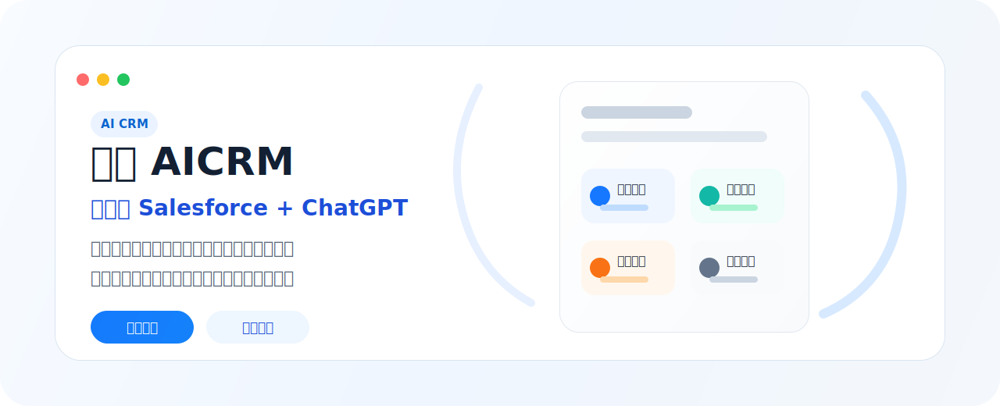

<div align="center">
  
  <h1>Wukong AICRM</h1>
  <p><strong>开源版 Salesforce + ChatGPT，让销售团队用对话完成客户管理、知识查询和任务执行。</strong></p>

  <p>
    <a href="LICENSE"></a>
    <a href="LICENSE"></a>
    <a href="https://github.com/WuKongOpenSource/Wukong-AICRM/stargazers"></a>
    <a href="https://github.com/WuKongOpenSource/Wukong-AICRM/pulls"></a>
  </p>

  <p>
    <a href="https://www.72crm.ai/"><strong>在线体验</strong></a>
    ·
    <a href="#快速开始"><strong>快速部署</strong></a>
    ·
    <a href="#产品预览"><strong>产品预览</strong></a>
    ·
    <a href="https://bbs.72crm.com#/forum/detail/2069232286842191872"><strong>社区讨论</strong></a>
    ·
    <a href="docs/i18n/README.en-US.md"><strong>English</strong></a>
  </p>
</div>

<p align="center">
  
</p>

<table>
  <tr>
    <td align="center"><a href="#立即体验"><strong>立即体验</strong></a></td>
    <td align="center"><a href="#核心能力"><strong>核心能力</strong></a></td>
    <td align="center"><a href="#产品预览"><strong>产品预览</strong></a></td>
    <td align="center"><a href="#技术栈"><strong>技术栈</strong></a></td>
    <td align="center"><a href="#快速开始"><strong>快速开始</strong></a></td>
    <td align="center"><a href="#配置说明"><strong>配置说明</strong></a></td>
  </tr>
</table>

---

## 中文版

悟空 AICRM 是面向销售团队、客户成功团队和业务管理者的开源 AI CRM。它把客户资料、沟通记录、任务日程、企业知识库和 AI 对话放在同一个工作流中，帮助团队更快判断客户状态、生成下一步动作、沉淀优秀经验，并持续提升销售执行效率。

传统 CRM 更擅长记录客户信息，而销售每天真正需要的是知道“今天该跟谁”“下一步做什么”“客户为什么停滞”“该如何专业回复”。悟空 AICRM 在完整 CRM 业务流程的基础上，引入 AI 客户智能、AI 任务日程和 AI 知识库能力，让系统不只是信息仓库，而是销售团队每天使用的智能执行工作台。

<table>
  <tr>
    <td width="33%">
      <h3>客户推进更清晰</h3>
      自动汇总客户资料、联系人、跟进记录和商机阶段，给出客户摘要、风险提醒与下一步建议。
    </td>
    <td width="33%">
      <h3>销售动作更自动</h3>
      从对话、会议和客户分析中提取待办事项，自动生成任务、日程、优先级与提醒。
    </td>
    <td width="33%">
      <h3>团队经验可复用</h3>
      连接产品资料、合同、会议纪要和优秀话术，让 AI 基于企业知识生成专业回答。
    </td>
  </tr>
</table>

## 立即体验

<table>
  <tr>
    <td width="33%">
      <strong>在线演示站</strong><br />
      <a href="https://www.72crm.ai/">https://www.72crm.ai/</a><br />
      注册云平台账号后体验完整产品能力。
    </td>
    <td width="33%">
      <strong>体验账号</strong><br />
      请在云平台注册新用户<br />
      用于测试在线演示站和 AI CRM 工作流。
    </td>
    <td width="33%">
      <strong>帮助与讨论</strong><br />
      <a href="https://bbs.72crm.com#/forum/detail/2069232286842191872">前往社区论坛</a><br />
      反馈问题、交流想法、参与共建。
    </td>
  </tr>
</table>

> 提示：请注册云平台账号后体验产品能力。生产环境上线后，请及时修改初始化管理员密码，并关闭不需要的演示数据。

## 核心能力

<table>
  <tr>
    <td width="50%">
      <h3>AI 对话助手</h3>
      像问同事一样询问客户、业绩、任务和知识库内容，系统可结合结构化数据与企业文档生成可追溯、可执行的业务回答。
    </td>
    <td width="50%">
      <h3>知识库 RAG 增强</h3>
      上传产品手册、合同、方案、会议纪要和话术材料，让 AI 基于企业资料回答，减少重复搜索。
    </td>
  </tr>
  <tr>
    <td width="50%">
      <h3>智能客户管理</h3>
      集中管理客户信息、联系人、跟进记录、商机阶段和客户上下文，自动识别客户阶段、需求重点和潜在风险。
    </td>
    <td width="50%">
      <h3>AI 任务生成</h3>
      在对话或客户分析后直接生成待办事项、提醒和优先级，把“应该做什么”变成可跟踪的工作项。
    </td>
  </tr>
  <tr>
    <td width="50%">
      <h3>团队协同</h3>
      客户动态、任务分配、知识更新和项目进展在团队内同步，让主管、销售、售前和客户成功围绕同一上下文协作。
    </td>
    <td width="50%">
      <h3>邮箱与沟通沉淀</h3>
      接入 Gmail、Outlook / Microsoft 365、自定义 IMAP / SMTP，沉淀邮件上下文并辅助生成沟通内容。
    </td>
  </tr>
</table>

## 产品预览

| AI 对话工作台 | 客户画像与智能分析 |
| :---: | :---: |
|  |  |

| 任务管理 | AI 知识库 |
| :---: | :---: |
|  |  |

## 典型场景

### 销售跟进

销售打开工作台即可查看今日优先客户、逾期任务和风险提醒。进入客户详情后，AI 会基于客户资料、跟进记录和历史任务生成摘要，提示下一步应该发资料、约演示、补报价还是安排复访。


### 主管协同

主管可以看到哪些重点客户长时间未跟进、哪些商机存在停滞风险、哪些销售任务逾期未处理，并在关键节点安排售前、客户成功或管理者介入。


### 客户成功

客户成功团队可以通过客户互动频率、服务问题、任务逾期和沟通记录提前识别风险客户，及时安排回访、升级处理或内部协同。


### 知识复用

系统可以将优秀销售的话术、方案、成交路径和行业经验沉淀到知识库中。新人面对客户问题时，可以通过 AI 调用企业知识生成更专业、更一致的回复。


## 整体架构

Wukong AICRM 以 AI Assistant 为统一交互入口，把客户管理、知识库问答和任务执行连接在同一个工作流中。


```text
┌───────────────┐
│     User      │
└──────┬────────┘
       │
       ▼
┌───────────────┐
│ AI Assistant  │
└──────┬────────┘
       │
 ┌─────┼─────┐
 │     │     │
 CRM  RAG  Workflow
 │     │     │
 └─────┼─────┘
       │
       ▼
 PostgreSQL
 Redis
 MinIO
```

## 技术栈

- 后端：Java 21、Spring Boot 3.x、Spring AI、PostgreSQL、Redis、MinIO
- 前端：Vue 3、TypeScript、Element Plus、Tailwind CSS、Pinia、Vite
- 部署：支持 Docker Compose 一键部署，提供完整生产环境配置

### 后端技术栈明细

| 技术 | 版本 | 说明 |
| :--- | :--- | :--- |
| Java | 21 | 编程语言 |
| Spring Boot | 3.3.12 | 应用框架 |
| Spring AI | 1.0.0 | AI / LLM 集成，支持 OpenAI 兼容 API |
| PostgreSQL | 17 | 主数据库 |
| MyBatis-Plus | 3.5.7 | 数据持久层框架 |
| Redis | - | 缓存与会话管理 |
| MinIO | - | 对象存储，用于文档和文件 |

### 前端技术栈明细

| 技术 | 版本 | 说明 |
| :--- | :--- | :--- |
| Vue | 3.4 | 前端框架 |
| TypeScript | 5.5 | 类型安全 |
| Element Plus | 2.8 | UI 组件库 |
| Pinia | 2.2 | 状态管理 |
| Tailwind CSS | 3.4 | 实用 CSS 框架 |
| Vite | 5.4 | 构建工具 |

## 项目结构

```text
wk_ai_crm/
├── backend/                 # 后端 Spring Boot 项目
│   ├── src/main/java/       # Java 源码
│   ├── src/main/resources/  # 配置文件
│   └── pom.xml              # Maven 配置
├── frontend/                # 前端 Vue 项目
│   ├── src/                 # 前端源码
│   └── package.json         # npm 配置
├── docker/                  # Docker 部署配置
│   ├── docker-compose.yaml  # 编排文件
│   └── nginx/               # Nginx 配置
├── docs/                    # 文档与产品截图
├── LICENSE                  # 协议文件
└── README.md                # 本文档
```

## 快速开始

推荐优先使用 Docker 一键安装；如果需要本地二次开发，再使用源码手动安装。

### 方式一：Docker 一键安装

先决条件：

- Docker
- Docker Compose

```bash
git clone https://github.com/WuKongOpenSource/Wukong-AICRM.git
cd Wukong-AICRM/docker
docker-compose up -d
```

访问 `http://localhost` 即可进入系统。

### 方式二：源码手动安装

先决条件：

- JDK 21+
- Node.js 18+
- Maven 3.8+
- PostgreSQL 17
- Redis 6+

1. 克隆项目

```bash
git clone https://github.com/WuKongOpenSource/Wukong-AICRM.git
cd Wukong-AICRM
```

2. 启动后端

```bash
cd backend
mvn clean install
mvn spring-boot:run
```

API 服务将在 `http://localhost:8088` 运行，Knife4j API 文档地址为 `http://localhost:8088/doc.html`。

3. 启动前端

```bash
cd frontend
npm install
npm run dev
```

前端将在 `http://localhost:5173` 运行。

首次运行前，请根据 `backend/src/main/resources/application.yml` 中的注释，配置数据库、AI API Key 和其他必要信息。

## 配置说明

主要配置文件：`backend/src/main/resources/application.yml`

### 数据库配置

```yaml
spring:
  datasource:
    url: jdbc:postgresql://localhost:5432/wk_ai_crm
    username: postgres
    password: your_password
```

### Redis 配置

```yaml
spring:
  data:
    redis:
      host: localhost
      port: 6379
      password: your_password
      database: 7
```

### AI 服务配置

```yaml
spring:
  ai:
    openai:
      api-key: your_api_key
      base-url: https://api.openai.com/v1/  # 或其他兼容 API
      chat:
        options:
          model: gpt-4
```

### MinIO 对象存储配置

```yaml
minio:
  enabled: true
  endpoint: http://localhost:9000
  access-key: minioadmin
  secret-key: minioadmin
  bucket: ai-crm
```

### WeKnora 知识库服务配置

```yaml
weknora:
  enabled: true
  base-url: http://localhost:8080/api/v1
  api-key: your_api_key
  knowledge-base-id: your_kb_id
```

## API 文档

启动后端服务后，访问 Knife4j API 文档：

```text
http://localhost:8088/doc.html
```

## 模型配置

悟空 AICRM 支持接入兼容 OpenAI API 格式的模型服务。你可以根据部署环境配置 OpenAI、DeepSeek、通义千问、豆包、智谱等模型供应商。安装完成后，需要到“系统设置”的“API / AI”中配置对应 Key，否则 AI 对话会报错。

## 常见问题

**Q：AI 模型支持哪些？**  
A：默认支持任何提供 OpenAI 兼容 API 的模型，如 OpenAI GPT 系列、DeepSeek、Ollama 本地模型等。在后台“系统设置”的“API / AI”配置中填入对应 API Key 即可。

**Q：商业使用时数据安全吗？**  
A：项目可完全私有化部署，客户、文档、AI 交互等数据均保存在你自己的服务器中，便于满足企业数据安全要求。

**Q：如何获取更多帮助？**  
A：可以访问项目的 <a href="https://bbs.72crm.com">社区论坛</a> 提问，或通过 GitHub Issues 反馈问题。

## 路线图

- 完善 AI 客户摘要、风险识别和下一步建议能力
- 增强任务日程自动生成和优先级排序
- 优化知识库检索、引用和内容生成效果
- 完善邮箱 OAuth 授权和邮件上下文沉淀
- 增强企业微信、飞书、钉钉等协同平台集成
- 提供更多行业模板和私有化部署示例
- 完善开发文档、接口文档和二次开发指南

## 适合谁使用

- 希望用 AI 提升销售跟进效率的中小企业
- 需要私有化部署 CRM 的企业团队
- 希望在 CRM 基础上做行业化二次开发的开发者
- 需要统一客户、任务、日程、知识库和邮件上下文的销售组织
- 希望沉淀销售经验、提升新人上手速度的管理团队

## 开源共建

欢迎通过 Issue、Pull Request 和社区讨论参与共建。你可以帮助我们：

- 提交问题反馈和复现步骤
- 改进安装部署文档
- 补充产品截图和使用教程
- 优化前端交互和移动端体验
- 完善 AI 提示词、知识库检索和模型接入
- 贡献行业模板、集成插件和自动化脚本

## 相关链接

- 官网：[https://www.72crm.com/](https://www.72crm.com/)
- AI CRM 产品页：[https://www.72crm.ai/](https://www.72crm.ai/)
- 开源版下载：[https://www.wukongcrm.com/](https://www.wukongcrm.com/)
- 社区论坛：[https://bbs.72crm.com/](https://bbs.72crm.com/)
- GitHub：[https://github.com/WuKongOpenSource/Wukong-AICRM](https://github.com/WuKongOpenSource/Wukong-AICRM)
- Gitee：[https://gitee.com/organizations/wukongcrm/projects](https://gitee.com/organizations/wukongcrm/projects)

## 开源协议

Wukong AICRM 源代码开放用于学习、研究、评估和其他非商业用途。商业使用、生产环境部署、托管服务、商业化衍生产品、插件 / Agent 市场合作以及品牌使用，需要取得单独商业授权。请阅读 [LICENSE](LICENSE)、[LICENSE.en.md](LICENSE.en.md)、[NOTICE](NOTICE) 和 [TRADEMARKS.md](TRADEMARKS.md)。

## 联系我们

如果你希望了解产品能力、私有化部署、二次开发或企业服务，可以通过官网、社区论坛或开源仓库 Issue 与我们联系。

<div align="center">
  <h2>欢迎 Star 与共建</h2>
  <p><strong>如果 Wukong AICRM 对你有帮助，请给我们一个 Star。这是对开源工作的最大鼓励。</strong></p>
  <p>
    <a href="https://github.com/WuKongOpenSource/Wukong-AICRM">GitHub 仓库</a>
    ·
    <a href="https://www.72crm.ai/">在线体验</a>
    ·
    <a href="https://bbs.72crm.com">社区论坛</a>
  </p>
</div>
