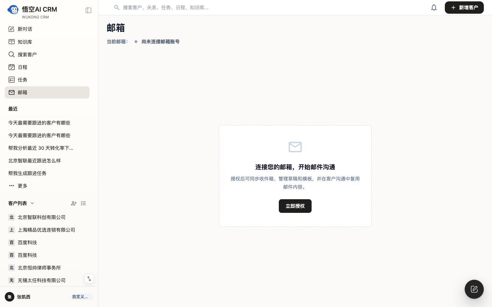
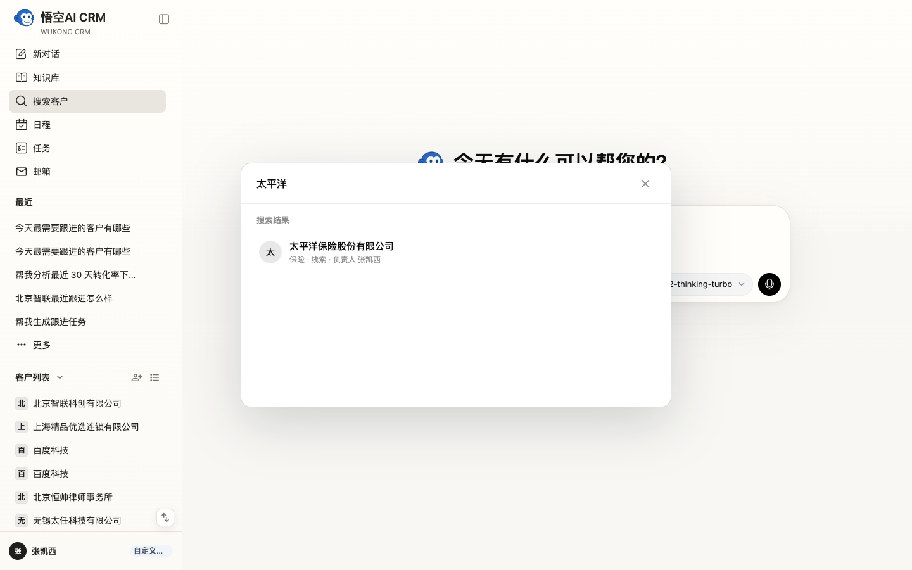

# Wukong AICRM


[](LICENSE)
[](LICENSE)
[](https://github.com/WuKongOpenSource/AI_CRM/stargazers)
[](https://github.com/WuKongOpenSource/AI_CRM/pulls)

**快速导航** | **Quick Nav:** [🇨🇳 中文](#-中文版--chinese) | [🇺🇸 English](docs/i18n/README.en-US.md)

---
<a id="-中文版--chinese"></a>
## 🇨🇳 中文版

> 开源版 Salesforce + ChatGPT
>
> 管理客户。  
> 查询知识。  
> 执行任务。  
> 全部通过对话完成。

### 🚀 立即体验
| 体验方式 | 地址/账号 | 说明 |
| :--- | :--- | :--- |
| **🌐 在线演示站** | [https://www.72crm.ai/](https://www.72crm.ai/) | 注册云平台账号后体验 |
| **🔑 体验账号** | 请在云平台注册新用户 | 用于测试在线演示站 |
| **💬 帮助与讨论** | [前往社区论坛](https://bbs.72crm.com#/forum/detail/2020712408698912768) | 反馈问题、交流想法 |

> **提示**：请注册云平台账号后体验产品能力，生产环境请及时修改初始化管理员密码。

### ✨ 它能做什么？
<table>
  <thead>
    <tr>
      <th align="left" width="180">功能模块</th>
      <th align="left">核心价值</th>
    </tr>
  </thead>
  <tbody>
    <tr>
      <td width="180"><nobr><strong>💬 AI对话助手</strong></nobr></td>
      <td><strong>像同事一样询问业务</strong>：“上一季度华东区的销售冠军是谁？”，系统可结合结构化数据与知识库文档，生成智能回答。</td>
    </tr>
    <tr>
      <td width="180"><nobr><strong>🧠 知识库RAG增强</strong></nobr></td>
      <td><strong>赋予AI“记忆”</strong>：上传公司产品手册、合同、会议纪要，AI助手能基于这些文档内容进行精准问答和总结。</td>
    </tr>
    <tr>
      <td width="180"><nobr><strong>👥 智能客户管理</strong></nobr></td>
      <td><strong>一体化客户视图</strong>：集中管理客户信息、联系人、跟进记录，并通过AI自动分析客户阶段与需求。</td>
    </tr>
    <tr>
      <td width="180"><nobr><strong>✅ AI任务生成</strong></nobr></td>
      <td><strong>自动创建工作项</strong>：在对话或分析客户后，可指令AI创建待办任务，并自动设置优先级与提醒。</td>
    </tr>
    <tr>
      <td width="180"><nobr><strong>🔗 无缝团队协作</strong></nobr></td>
      <td><strong>信息实时同步</strong>：客户动态、任务分配、知识更新均在团队内即时同步，促进高效协作。</td>
    </tr>
  </tbody>
</table>

### 🧩 整体架构

Wukong AICRM 以 AI Assistant 为统一交互入口，把客户管理、知识库问答和任务执行连接在同一个工作流中。

```text
┌───────────────┐
│    User       │
└──────┬────────┘
       │
       ▼
┌───────────────┐
│ AI Assistant  │
└──────┬────────┘
       │
 ┌─────┼─────┐
 │     │     │
 CRM  RAG  Workflow
 │     │     │
 └─────┼─────┘
       │
       ▼
 PostgreSQL
 Redis
 MinIO
```
### 🛠️ 技术栈

- **后端**: Java 21 + Spring Boot 3.x + Spring AI + PostgreSQL + Redis + MinIO
- **前端**: Vue 3 + TypeScript + Element Plus + Tailwind CSS
- **部署**: 支持 Docker Compose 一键部署，提供完整生产环境配置。

#### 后端技术栈明细
| 技术 | 版本 | 说明 |
| :--- | :--- | :--- |
| Java | 21 | 编程语言 |
| Spring Boot | 3.3.12 | 应用框架 |
| Spring AI | 1.0.0 | AI/LLM 集成 (支持 OpenAI 兼容 API) |
| PostgreSQL | 17 | 主数据库 |
| MyBatis-Plus | 3.5.7 | 数据持久层框架 |
| Redis | - | 缓存与会话管理 |
| MinIO | - | 对象存储（用于文档、文件） |

#### 前端技术栈明细
| 技术 | 版本 | 说明 |
| :--- | :--- | :--- |
| Vue | 3.4 | 前端框架 |
| TypeScript | 5.5 | 类型安全 |
| Element Plus | 2.8 | UI 组件库 |
| Pinia | 2.2 | 状态管理 |
| Tailwind CSS | 3.4 | 实用CSS框架 |
| Vite | 5.4 | 构建工具 |

### 📁 项目结构
```
wk_ai_crm/
├── backend/                 # 后端 Spring Boot 项目
│   ├── src/main/java/       # Java 源码
│   ├── src/main/resources/  # 配置文件
│   └── pom.xml              # Maven 配置
├── frontend/                # 前端 Vue 项目
│   ├── src/                 # 前端源码
│   └── package.json         # npm 配置
└── docker/                  # Docker 部署配置
    ├── docker-compose.yaml  # 编排文件
    └── nginx/               # Nginx 配置
└── LICENSE.md               # 协议文件
└── README.md                # 本文档

```
### ⚡️ 快速开始

推荐优先使用 Docker 一键安装；如果你需要本地二次开发，再使用源码手动安装。

#### 方式一：Docker 一键安装（推荐）

先决条件：

- Docker
- Docker Compose

```bash
git clone https://github.com/WuKongOpenSource/AI_CRM.git
cd AI_CRM/docker
docker-compose up -d
# 访问 http://localhost 即可
```

#### 方式二：源码手动安装

先决条件：

- JDK 21+
- Node.js 18+
- Maven 3.8+
- PostgreSQL 17
- Redis 6+

1. 克隆项目

```bash
git clone https://github.com/WuKongOpenSource/AI_CRM.git
cd AI_CRM
```

2. 后端启动

```bash
cd backend
mvn clean install
mvn spring-boot:run
# API 服务将在 http://localhost:8088 运行
# API 文档（Knife4j）：http://localhost:8088/doc.html
```

3. 前端启动

```bash
cd frontend
npm install
npm run dev
# 前端将在 http://localhost:5173 运行
```

配置文件：首次运行前，请根据 `backend/src/main/resources/application.yml` 中的注释，配置数据库、AI API 密钥（如 OpenAI、DeepSeek 等）等必要信息。

## 配置说明

主要配置文件：`backend/src/main/resources/application.yml`

### 数据库配置

```yaml
spring:
  datasource:
    url: jdbc:postgresql://localhost:5432/wk_ai_crm
    username: postgres
    password: your_password
```

### Redis 配置

```yaml
spring:
  data:
    redis:
      host: localhost
      port: 6379
      password: your_password
      database: 7
```

### AI 服务配置

```yaml
spring:
  ai:
    openai:
      api-key: your_api_key
      base-url: https://api.openai.com/v1/  # 或其他兼容 API
      chat:
        options:
          model: gpt-4
```

### MinIO 对象存储配置

```yaml
minio:
  enabled: true
  endpoint: http://localhost:9000
  access-key: minioadmin
  secret-key: minioadmin
  bucket: ai-crm
```

### WeKnora 知识库服务配置

```yaml
weknora:
  enabled: true
  base-url: http://localhost:8080/api/v1
  api-key: your_api_key
  knowledge-base-id: your_kb_id
```

## API 文档

启动后端服务后，访问 Knife4j API 文档：

```
http://localhost:8088/doc.html
```

## 体验账号

请在云平台注册新用户进行体验。生产环境上线后请立即修改初始化管理员密码，并关闭不需要的演示数据。

## 模型配置

- 安装完成需要到“系统设置”的“API/AI”中进行AI大模型配置，输入对应的key，否则对话会出错。

---

### 🤝 欢迎贡献
Wukong AICRM 正处于快速成长阶段，我们热烈欢迎任何形式的贡献！
- 🐛 **报告问题**：使用 [GitHub Issues](https://github.com/WuKongOpenSource/AI_CRM/issues) 提交Bug或新功能建议。
- 🔧 **提交代码**：请阅读我们的贡献指南（待创建），了解开发流程和代码规范。
- 📖 **完善文档**：帮助改进文档、翻译，让项目更易懂。
- 💡 **分享想法**：在[社区论坛](https://bbs.72crm.com)分享你的使用场景或优化建议。

### 📄 许可证
Wukong AICRM 源代码开放用于学习、研究、评估和其他非商业用途。商业使用、生产环境部署、托管服务、商业化衍生产品、插件 / Agent 市场合作以及品牌使用，需要取得单独商业授权。请阅读 [LICENSE](LICENSE)、[LICENSE.en.md](LICENSE.en.md)、[NOTICE](NOTICE) 和 [TRADEMARKS.md](TRADEMARKS.md)。

### ❓ 常见问题
**Q：AI模型支持哪些？**
A：默认支持任何提供 OpenAI 兼容 API 的模型（如 OpenAI GPT系列、DeepSeek、Ollama本地模型等）。在后台“系统设置”的“API/AI”配置中填入对应API Key即可。

**Q：商业使用时数据安全吗？**
A：项目可完全私有化部署，所有数据（客户、文档、AI交互）均保存在您自己的服务器中，确保数据安全。

**Q：如何获取更多帮助？**
A：您可以访问项目的 [社区论坛](https://bbs.72crm.com) 提问或搜索现有答案。

### 🖼️ 功能模块截图与价值总结

基于 2026-06-22 登录体验整理。

本文档按模块整理系统截图、主要功能与核心价值。截图来自实际登录体验，并包含已创建的测试数据：产品「悟空CRM企业版实施包」、关系人「陈晓航」、项目「北京智联 CRM 试点实施项目」。

#### 模块覆盖

- AI 对话：统一入口，串联业务对象和行动。
- 客户：列表、详情、AI 分析和跟进，支撑客户资产管理与商机推进。
- 任务 / 日程：AI 解析、状态、优先级和时间视图，把销售动作落到计划。
- 知识库 / 话术：RAG、文档和 AI 话术，将资料转化为可复用销售内容。
- 项目：项目列表、项目 AI 对话和泳道，管理复杂商机或交付项目。
- 产品 / 通讯录 / 关系 / 邮箱：补齐销售运营所需的基础数据和沟通资产。

#### 1. AI 对话首页

- **主要功能**：新对话、自然语言输入、文件/语音入口、模型切换、最近对话与业务对象侧边栏。
- **核心价值**：作为系统总入口，用对话方式串联客户、任务、日程、项目和知识库，降低销售人员查找与录入成本。


#### 2. 客户列表

- **主要功能**：客户表格、普通搜索、AI 搜索、列表/网格/看板视图、行内编辑、AI 跟进。
- **核心价值**：集中管理客户资产、商机阶段、客户等级、预计成交和下次跟进，帮助销售快速判断优先级。


#### 3. 客户详情与 AI 分析

- **主要功能**：基本信息、AI 报告摘要、潜力评分、深度分析、活动、跟进记录、联系人、任务、日程、文档。
- **核心价值**：把客户资料、销售过程和 AI 洞察放在同一工作台，支持围绕客户上下文直接提问和创建行动。


#### 4. 任务管理

- **主要功能**：全部/待处理/进行中/已完成筛选、AI 评分、关联客户/项目、优先级、截止日期、开始处理和标记完成。
- **核心价值**：将销售动作结构化，并通过 AI 评分辅助判断任务价值与紧急程度。


#### 5. 新建任务 AI 解析

- **主要功能**：一句话解析任务标题、描述、类型、优先级、客户、项目、参与人和截止时间。
- **核心价值**：减少手动填写字段的时间，把自然语言跟进要求转化为可执行任务。


#### 6. 智能日程

- **主要功能**：周/月/列表视图、上一段/今天/下一段、会议和待办汇总、新增日程。
- **核心价值**：让销售拜访、会议和客户跟进在时间维度上可视化，避免关键沟通遗漏。


#### 7. 新增日程智能解析

- **主要功能**：一句话补齐标题、开始/结束时间、类型、关联客户、参与人、地点和备注。
- **核心价值**：把“约客户开会”这类自然语言安排快速落到日历，提升日程录入效率。


#### 8. 知识库

- **主要功能**：文档上传、AI 提问、分类筛选、RAG 就绪状态、文档摘要。
- **核心价值**：沉淀产品、方案、会议、合同、邮件、录音等资料，让销售可随时通过 AI 检索和复用知识。


#### 9. AI 话术生成器

- **主要功能**：选择参考文档、选择目标客户、生成针对性话术或 SOP。
- **核心价值**：把知识库内容转化为客户场景下可直接使用的销售话术和异议处理素材。


#### 10. 产品管理

- **主要功能**：产品类目、产品名称/编码、类型、单位、价格、负责人、启停、转移、编辑。
- **核心价值**：维护可复用的产品与服务资料，支撑报价、方案输出和销售过程标准化。


#### 11. 通讯录

- **主要功能**：内部员工列表、部门/职位/手机号/邮箱搜索、在职/离职/停用过滤、最近相关任务。
- **核心价值**：作为内部协作底座，支撑负责人、参与人、任务分派和跨部门协同。


#### 12. 关系管理

- **主要功能**：外部联系人、人脉关系类型、所属公司、来源、编辑和删除。
- **核心价值**：沉淀客户联系人之外的人脉资产，帮助销售维护合作伙伴、投资人、供应商等关系网络。


#### 13. 项目列表

- **主要功能**：项目搜索、状态筛选、网格/列表视图、负责人、关联客户、最近更新、项目任务统计。
- **核心价值**：适合管理试点、交付、实施和方案推进等跨任务销售项目。


#### 14. 项目详情与任务泳道

- **主要功能**：项目上下文 AI 对话、任务泳道图、未开始/进行中/已完成泳道、侧栏任务概览。
- **核心价值**：把项目进展、项目任务和项目 AI 协作集中在一个页面，适合持续推进复杂商机。


#### 15. 邮箱模块

- **主要功能**：邮箱授权入口、同步收件箱、草稿、模板和邮件沟通内容复用。
- **核心价值**：连接邮箱后可把邮件沟通纳入客户上下文，形成更完整的销售记录。



#### 16. 全局客户搜索

- **主要功能**：任意页面弹出搜索框，按客户名称即时筛选，并显示行业、阶段、负责人。
- **核心价值**：减少页面跳转，用轻量入口快速定位客户并进入客户上下文。



#### 17. AI 设置与模型服务

- **主要功能**：AI 积分额度、自定义模型状态、AI 设置、配置 AI 服务。
- **核心价值**：支持企业配置自有 AI 服务和模型能力，便于控制成本、能力边界和合规要求。


---
<div align="center">

## 🌟 项目动态

**如果 Wukong AICRM 对你有帮助，请给我们一个 ⭐️ Star！这是对我们开源工作的最大鼓励。**<br>

</div>
